# 非常勤職員 採用関連業務フロー（As-Is・To-Be／手続き別）

## 1. 本資料の位置付け

本資料は、非常勤職員の採用関連業務について、AからGまでの手続きごとにAs-IsとTo-Beの業務フローを対比するための構成確認資料である。

上司および現場ユーザーとの認識合わせを目的とし、最終的なPowerPoint業務フロー図を作成する前段階として使用する。To-Beは現時点の見直し案であり、業務確認および要件定義を通じて更新する。

### 表現ルール

- 青：通常の業務・アプリ内処理
- 橙：手作業、転記、紙またはExcel中心の処理
- 緑：システム連携、電子化または再利用
- 赤：現行業務の主な課題
- 灰：帳票、ファイル、開始・終了または補足
- A・B・Fは通常の非常勤職員のみを対象とし、調査員は対象外とする。

---

## 2. 手続きA｜内定手続き

### 2.1 As-Is

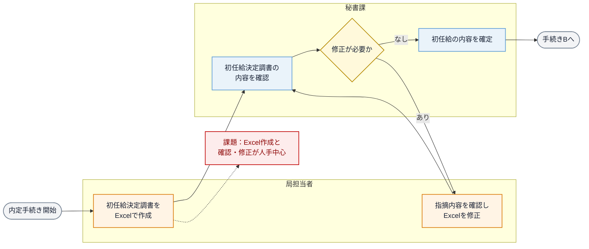

> 「秘書課との調整」を確認・修正の往復として可視化している。具体的な提出方法と確定権限は現場確認事項とする。

### 2.2 To-Be

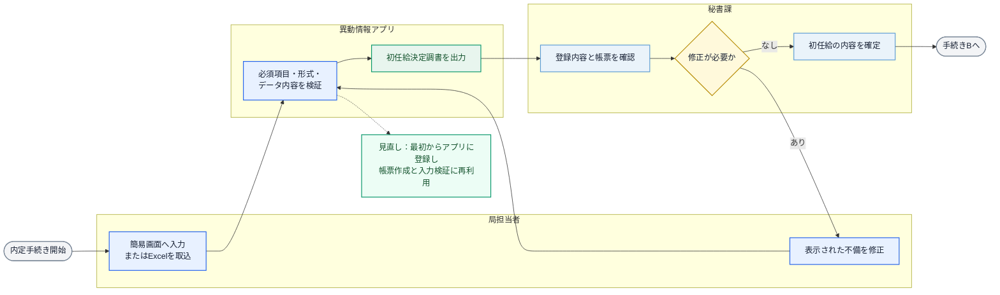

---

## 3. 手続きB｜採用起案

### 3.1 As-Is

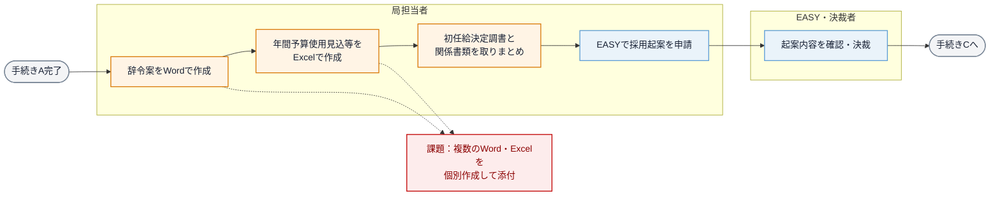

### 3.2 To-Be

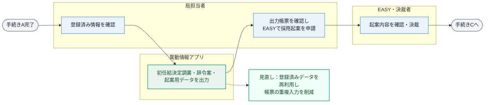

> EASYとの直接連携は現時点では前提とせず、アプリから出力した情報を起案に利用する構成としている。

---

## 4. 手続きC｜発令

### 4.1 As-Is

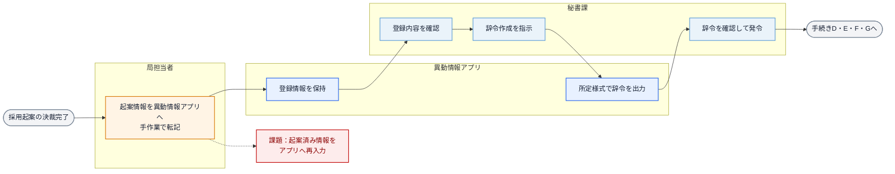

### 4.2 To-Be

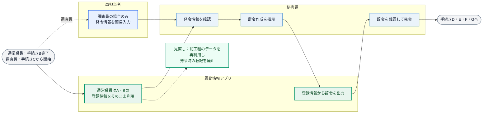

---

## 5. 手続きD｜職員DB登録・異動情報アプリ更新

### 5.1 As-Is

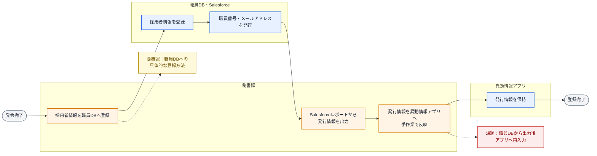

### 5.2 To-Be

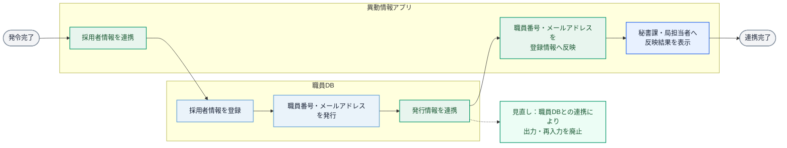

---

## 6. 手続きE｜給与基本マスタへの登録

### 6.1 As-Is

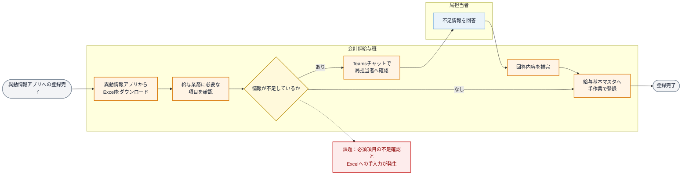

### 6.2 To-Be

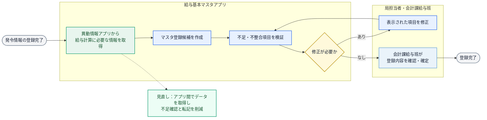

---

## 7. 手続きF｜通勤手当の認定

### 7.1 As-Is

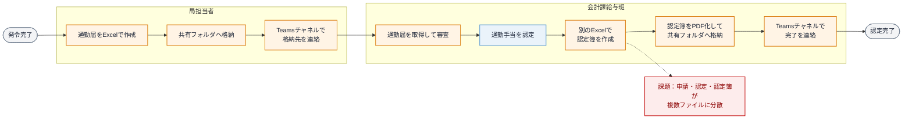

### 7.2 To-Be

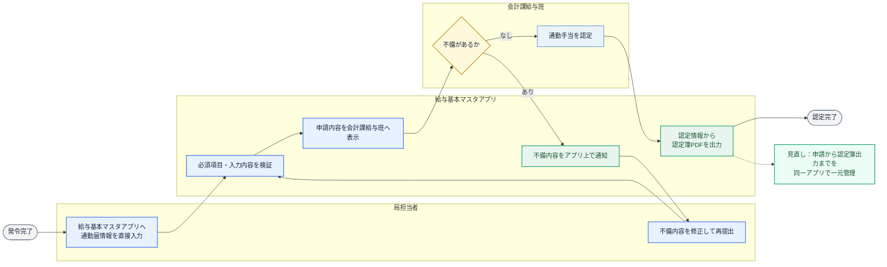

> 手続きFは通常の非常勤職員のみを対象とし、調査員は対象外とする。

---

## 8. 手続きG｜外部機関との手続き

### 8.1 As-Is

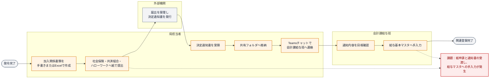

#### 転職者の住民税手続き（As-Is補足）

### 8.2 To-Be

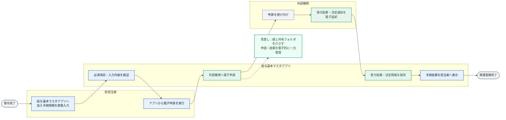

#### 転職者の住民税手続き（To-Be補足）

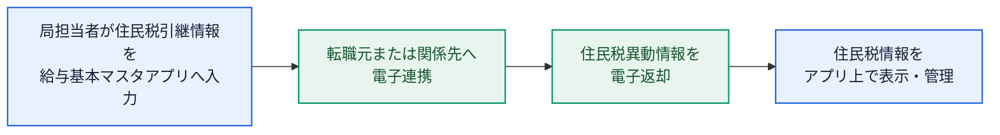

---

## 9. PowerPoint化に向けた確認事項

本資料を基に、手続きごとに次の事項を確認する。

1. As-Isの実施者、処理順序および受渡方法が実態と一致しているか。
2. 図中で補完した確認・修正の往復が実態と一致しているか。
3. 課題の位置と表現が適切か。
4. To-Beの役割分担およびアプリの範囲が適切か。
5. 外部機関との電子連携が制度・技術上可能か。
6. 各図を最終的に1手続き1枚とするか、複数手続きを1枚に統合するか。

## 10. 現時点の未確認事項

- 手続きAにおける初任給決定調書の提出方法、修正依頼方法および最終確定者
- 手続きBで実際に添付する書類の全件
- 職員DBへの具体的な登録方法
- 調査員について、C・D・E・Gに固有の差異があるか
- 通勤手当の認定結果を給与基本マスタへ反映する後続処理
- 外部機関ごとの電子申請・電子返却の実現方式

## 11. 更新履歴

| 版 | 更新日 | 更新内容 |
|---|---|---|
| 0.1 | 2026-09-10 | A～Gの手続き別As-Is・To-Beフロー初版を作成 |
