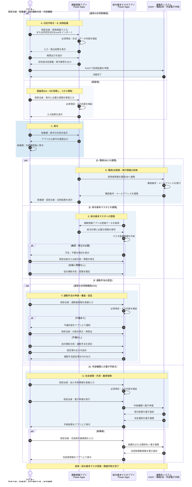

# 非常勤職員 採用関連業務・システム全体概要（As-Is・To-Be・中間版）

## 1. 本資料の位置付け

本資料は、非常勤職員の採用から給与基本マスタ登録までの業務について、個別アプリケーションだけでなく、担当者、業務手続き、システム、Excel等の業務ファイルおよび外部機関との関係を一体として整理した中間報告である。

対象範囲は、現行手続き（As-Is）のA「内定手続き」からG「外部機関との手続き」まで、および現時点で整理した見直し案（To-Be）とする。To-Beは中間検討段階の案であり、今後の業務整理および要件定義により更新する。

## 2. 対象者と例外

### 2.1 通常の非常勤職員

AからGまでの各手続きの対象となる。ただし、個人の条件によって、社会保険、共済、雇用保険および住民税に関する手続きの要否は異なる。

### 2.2 調査員

調査員とは、親元企業に在籍したまま当方へ出向し、当方からも給与が支給される者をいう。

調査員には、次の手続きがない。

- A. 内定手続き
- B. 採用起案
- F. 通勤手当の認定

現時点では、C・D・E・Gは調査員にも適用されるものとして整理する。

## 3. 主な関係者

| 区分 | 関係者 | 主な役割 |
|---|---|---|
| 内部 | 局担当者 | 採用関係書類の作成、各システムへの登録、通勤届の提出、外部機関への手続き |
| 内部 | 秘書課 | 初任給決定調書の確定調整、辞令作成・発令、職員DBへの登録 |
| 内部 | 会計課給与班 | 給与基本マスタへの登録、通勤手当の審査・認定、外部手続結果の反映 |
| 外部 | 社会保険関係機関 | 社会保険の加入手続き受付、決定通知 |
| 外部 | 共済組合 | 共済加入手続きの受付 |
| 外部 | ハローワーク | 雇用保険の加入手続き受付、決定通知 |
| 外部 | 転職元の人事担当 | 転職者に係る住民税異動届の提供 |

## 4. 主なシステム・ツール・業務ファイル

| 種別 | 名称 | 主な用途 |
|---|---|---|
| 電子決裁 | EASY | 採用起案の申請・決裁 |
| 業務アプリ | 異動情報アプリ（Power Apps） | 採用・異動情報の登録、辞令作成に用いる情報の管理 |
| 職員DB | Salesforce | 採用者情報の登録、職員番号・メールアドレスの発行 |
| 出力機能 | Salesforceレポート | 職員番号・メールアドレス等の出力 |
| マスタ | 給与基本マスタ（Excel） | 給与計算に必要な職員基本情報の管理 |
| 連絡 | Teamsチャネル／Teamsチャット | 書類格納・処理完了の連絡、不足情報の確認 |
| 保存先 | 共有フォルダ | 通勤届、認定簿PDF、外部機関からの通知書等の共有 |
| 業務ファイル | 初任給決定調書（Excel） | 初任給の決定内容を整理 |
| 業務ファイル | 辞令案（Word） | 採用起案に添付する辞令案 |
| 業務ファイル | 年間予算使用見込（Excel） | 採用起案に添付する年間予算見込 |
| 業務ファイル | 通勤届（Excel） | 通勤手当の申請・審査 |
| 業務ファイル | 通勤手当認定簿作成ファイル（Excel） | 認定結果を基に認定簿を作成 |
| 成果物 | 通勤手当認定簿（PDF） | 通勤手当の認定結果を保存・共有 |

## 5. 手続き別概要

### A. 内定手続き

局担当者が内定前に初任給決定調書（Excel）を作成する。秘書課との調整を経て、初任給決定調書の内容を確定する。

### B. 採用起案

局担当者が辞令案（Word）や年間予算使用見込（Excel）などを作成し、Aで確定した初任給決定調書とともにEASYへ添付する。EASYで採用起案を申請し、決裁を受ける。

記載したファイルは添付書類の例であり、実際にはこのほかの書類も添付される。

### C. 発令

局担当者がBの採用起案情報を、異動情報アプリ（Power Apps）へ手作業で転記する。秘書課は登録情報を基に、異動情報アプリ所定の様式で辞令を作成して発令する。

EASYと異動情報アプリの間に連携機能はない。また、Bで作成したWordの辞令案は、その様式のまま辞令作成に再利用されない。アプリ登録後には秘書課と局担当者のTeamsチャネルへ自動投稿されるが、中間概要図では省略する。

### D. 職員DB登録・異動情報アプリ更新

発令後、秘書課が採用者情報を職員DB（Salesforce）へ登録し、職員番号とメールアドレスを発行する。秘書課はSalesforceレポートから発行情報を出力し、異動情報アプリへ手作業で反映する。

職員DBへの登録方法は、インポート機能を使用している可能性があるが、現時点では未確認である。

### E. 給与基本マスタへの登録

会計課給与班が、異動情報アプリから日々Excelをダウンロードし、給与基本マスタ（Excel）へ手作業で登録する。給与業務に必要な情報が異動情報アプリで必須入力になっていないため、不足時にはTeamsチャットで局担当者へ確認し、情報を補完する。

### F. 通勤手当の認定

局担当者が通勤届（Excel）を共有フォルダへ格納し、Teamsチャネルで会計課給与班へ連絡する。会計課給与班は内容を審査して通勤手当を認定し、通勤届とは別の通勤手当認定簿作成ファイル（Excel）で認定簿を作成する。認定簿をPDFへ変換して同じ共有フォルダへ格納し、Teamsチャネルで局担当者へ連絡する。

FはCの完了後に開始し、Eと並行して進む。

### G. 外部機関との手続き

局担当者が、Fと並行して社会保険、共済組合およびハローワークへの加入手続きを行う。電子申請は行わず、手書きまたはExcelから出力した書類を紙で提出する。社会保険関係機関とハローワークから受領した決定通知書は共有フォルダへ格納し、Teamsチャットで会計課給与班へ連絡する。

転職者の場合、局担当者は転職元の人事担当から住民税異動届を受領し、共有フォルダへ格納して会計課給与班へ連絡する。会計課給与班は、紙または転記困難なファイルを目視確認し、給与基本マスタへ手入力する。

## 6. 業務全体の関係

通常の非常勤職員は、A「内定手続き」、B「採用起案」、C「発令」の順に進む。Cの完了後、秘書課によるD「職員DB登録・異動情報アプリ更新」を経て、会計課給与班がE「給与基本マスタへの登録」を行う。

Cの完了後には、Eと並行してF「通勤手当の認定」およびG「外部機関との手続き」が進む。Gで得た社会保険、雇用保険および住民税の情報は、会計課給与班が給与基本マスタへ追加登録する。

調査員はA・B・Fを通らず、Cから後続手続きへ進む。

## 7. 中間概要図に表現する関係

- AからB、BからCへの主要な業務の流れ
- C以降のD・E、F、Gへの分岐と並行関係
- 局担当者、秘書課、会計課給与班の役割
- EASY、異動情報アプリ、職員DB、給与基本マスタの関係
- Word、Excel、PDF、紙書類および共有フォルダの受け渡し
- システム間の自動連携がなく、転記・目視・手入力が発生する箇所
- 調査員がA・B・Fを対象外とする例外

## 8. 現時点の主な課題

- EASY、異動情報アプリ、職員DBおよび給与基本マスタが相互に自動連携しておらず、転記が複数回発生する。
- 採用起案のWord辞令案が、実際の辞令作成時に様式として再利用されない。
- 異動情報アプリの必須項目が給与業務の必要項目を満たしておらず、Teamsチャットによる追加確認が発生する。
- 外部機関との手続きが紙中心であり、会計課給与班が結果を目視して給与基本マスタへ手入力する。
- 通勤届、認定簿作成ファイルおよび認定簿PDFが別ファイルで管理される。

## 9. 未確認事項

- 共有フォルダの具体的な保存基盤
- 秘書課が職員DBへ登録する際の詳細な登録方法
- C・D・E・Gについて、調査員に固有の手続き差異があるか
- Fの認定結果を給与基本マスタへ反映する後続手続き

## 10. シーケンス図

```mermaid
%%{init: {
  "theme": "base",
  "themeVariables": {
    "background": "#ffffff",
    "primaryColor": "#eaf3fa",
    "primaryBorderColor": "#5b9bd5",
    "primaryTextColor": "#172033",
    "actorBkg": "#f4f8fb",
    "actorBorder": "#5b9bd5",
    "actorTextColor": "#172033",
    "actorLineColor": "#7a8797",
    "signalColor": "#334155",
    "signalTextColor": "#172033",
    "labelBoxBkgColor": "#f4f8fb",
    "labelBoxBorderColor": "#9dc3e6",
    "labelTextColor": "#172033",
    "loopTextColor": "#172033",
    "noteBkgColor": "#4b5563",
    "noteBorderColor": "#374151",
    "noteTextColor": "#ffffff",
    "activationBkgColor": "#dbeafe",
    "activationBorderColor": "#5b9bd5",
    "sequenceNumberColor": "#ffffff"
  },
  "themeCSS": "
    #actor0.actor-line{stroke:#374151!important;stroke-width:2px!important;}
    #actor1.actor-line{stroke:#2563eb!important;stroke-width:2px!important;}
    #actor2.actor-line{stroke:#059669!important;stroke-width:2px!important;}
    #actor3.actor-line{stroke:#d97706!important;stroke-width:2px!important;}
    #actor4.actor-line{stroke:#7c3aed!important;stroke-width:2px!important;}
  "
}}%%

sequenceDiagram
    autonumber

    actor ACT as アクター<br/>局担当者・秘書課・会計課給与班・外部機関
    participant APP as 異動情報アプリ<br/>Power Apps
    participant MASTER as 給与基本マスタ<br/>Excel
    participant FOLDER as 共有フォルダ
    participant OTHER as その他システム<br/>職員DB・EASY

    rect rgb(245, 248, 252)
        Note over ACT: 対象者による手続きの違い
        ACT->>ACT: 調査員はA・B・Fの対象外
        ACT->>ACT: 調査員はCから手続きを開始
    end

    opt 通常の非常勤職員のみ
        rect rgb(234, 243, 250)
            Note over ACT: A. 内定手続き
            ACT->>ACT: 局担当者：初任給決定調書（Excel）を作成
            ACT->>ACT: 局担当者・秘書課：内容を確認・確定
        end

        rect rgb(234, 243, 250)
            Note over ACT,OTHER: B. 採用起案
            ACT->>OTHER: 局担当者：EASYで採用起案を申請
            OTHER-->>ACT: EASY：決裁完了
        end

        rect rgb(248, 250, 252)
            ACT->>ACT: 添付書類例
            Note over ACT: 辞令案（Word）／年間予算使用見込（Excel）／初任給決定調書（Excel）
        end
    end

    rect rgb(217, 234, 247)
        Note over ACT,APP: C. 発令
        ACT->>APP: 局担当者：起案情報を手作業で転記
        APP-->>ACT: 秘書課：登録情報を表示
        ACT->>APP: 秘書課：アプリ所定様式で辞令作成を指示
        APP-->>ACT: 異動情報アプリの様式で辞令を出力
        ACT->>ACT: 秘書課：発令
    end

    par D・E：職員情報・給与基本マスタ
        rect rgb(234, 243, 250)
            Note over APP,OTHER: D. 職員DB登録・異動情報アプリ更新
            APP-->>OTHER: 採用者情報を職員DBへ連携<br/>※連携方法は未確認
            OTHER->>OTHER: 職員DB（Salesforce）へ登録
            OTHER->>OTHER: 職員番号・メールアドレスを発行
            OTHER-->>ACT: Salesforceレポートから発行情報を出力
            ACT->>APP: 秘書課：発行情報を手作業で反映
        end

        rect rgb(234, 243, 250)
            Note over ACT,MASTER: E. 給与基本マスタへの登録
            ACT->>APP: 会計課給与班：異動情報の出力を指示
            APP-->>ACT: 異動情報をExcelで出力

            opt 必要情報が不足
                ACT->>ACT: 会計課給与班から局担当者へ<br/>Teamsチャットで確認
                ACT->>ACT: 局担当者が不足情報を回答
            end

            ACT->>MASTER: 会計課給与班：異動情報を手作業で登録
        end

    and F：通勤手当の認定
        opt 通常の非常勤職員のみ
            rect rgb(234, 243, 250)
                Note over ACT,FOLDER: F. 通勤手当の認定
                ACT->>FOLDER: 局担当者：通勤届（Excel）を格納
                ACT->>ACT: 局担当者から会計課給与班へ<br/>Teamsチャネルで格納先を連絡
                FOLDER-->>ACT: 会計課給与班：通勤届を取得
                ACT->>ACT: 会計課給与班：内容を審査
                ACT->>ACT: 会計課給与班：通勤手当を認定
                ACT->>ACT: 認定簿作成ファイル（Excel）で認定簿を作成
                ACT->>FOLDER: 認定簿（PDF）を格納
                ACT->>ACT: 会計課給与班から局担当者へ<br/>Teamsチャネルで完了連絡
            end
        end

    and G：外部機関との手続き
        rect rgb(234, 243, 250)
            Note over ACT,FOLDER: G. 社会保険・共済・雇用保険
            ACT->>ACT: 局担当者が加入書類を作成
            ACT->>ACT: 社会保険・共済組合・ハローワークへ紙で提出
            ACT->>ACT: 社会保険・ハローワークから<br/>決定通知書を受領
        end

        opt 転職者
            ACT->>ACT: 局担当者から転職元の人事担当へ連絡
            ACT->>ACT: 住民税異動届を受領
        end

        ACT->>FOLDER: 局担当者：受領書類を格納
        ACT->>ACT: 局担当者から会計課給与班へ<br/>Teamsチャットで格納を連絡
        FOLDER-->>ACT: 会計課給与班：受領書類を取得
        ACT->>MASTER: 会計課給与班：目視確認して手入力
    end

    Note over ACT,OTHER: 採用関連手続き完了
```

## 11. To-Beの基本方針

- 採用・発令に必要な情報は初めから異動情報アプリへ入力し、必要な帳票はアプリから出力する。
- 入力画面の必須項目を見直して簡素化し、Excelで入力データを用意する場合はインポート機能で品質を確保する。
- 給与基本マスタをPower Apps化し、異動情報アプリの登録データを給与基本マスタアプリから取得できるようにする。
- 外部機関との紙・手書き手続きを電子化する。
- 共有フォルダを介した情報把握と転記を廃止し、給与基本マスタアプリへの直接入力とアプリ上での管理へ移行する。

## 12. To-Beシーケンス図

